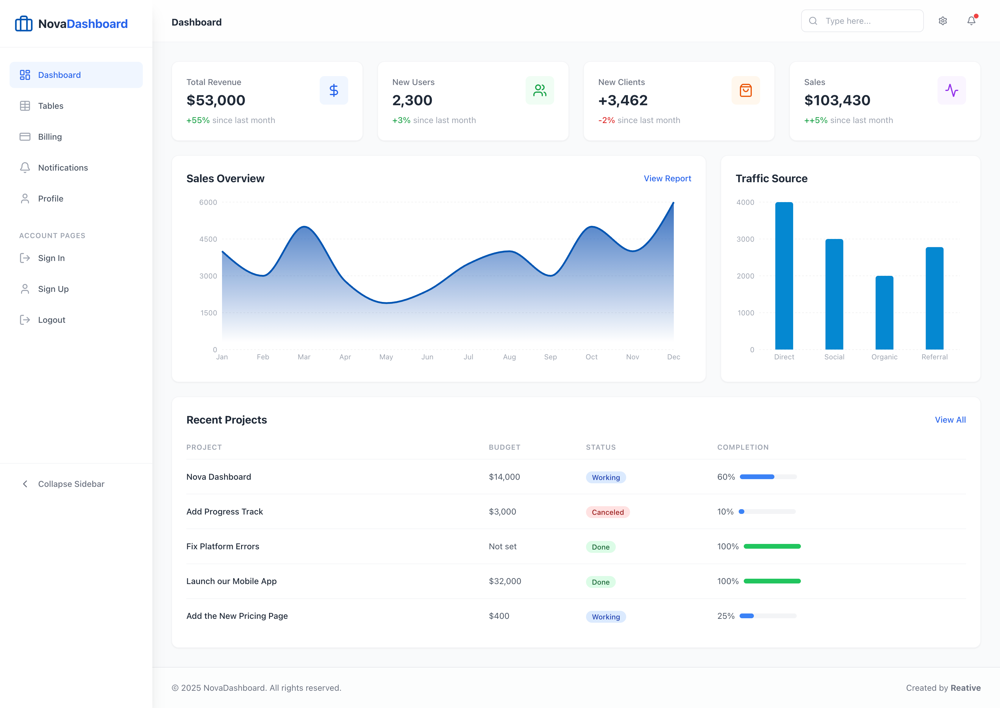

# NovaDashboard - React Tailwind Admin Template



**NovaDashboard** is a free, open-source admin dashboard template. It provides a clean, modern interface for building data-rich applications. Ideal for **React admin panels**, **SaaS dashboards**, and **back-office applications**. Built with **Tailwind CSS** for easy customization.

---

## Features

-   **Clean Interface:** Minimalist and effective design.
-   **Data Visualization:** Ready-to-use chart components.
-   **Modular Code:** Easy to extend and maintain.

## 🚀 Quick Start

1.  **Clone the repository**
    ```bash
    git clone <repository-url>
    cd Nova-Dashboard
    ```

2.  **Install dependencies**
    ```bash
    npm install
    ```

3.  **Start development server**
    ```bash
    npm run dev
    ```

## 💎 Upgrade to Pro

Build powerful admin panels with NovaDashboard Pro:

-   **Advanced Charts:** Interactive charts for data visualization.
-   **Data Tables:** Sortable, filterable, and paginated tables.
-   **Auth System:** Complete authentication flows.
-   **Profile & Settings:** User management pages.

[**Get NovaDashboard Pro**](https://reative.org/product/nova-dashboard)

## License

&copy; 2025 Reative. This project is licensed under the MIT License.
